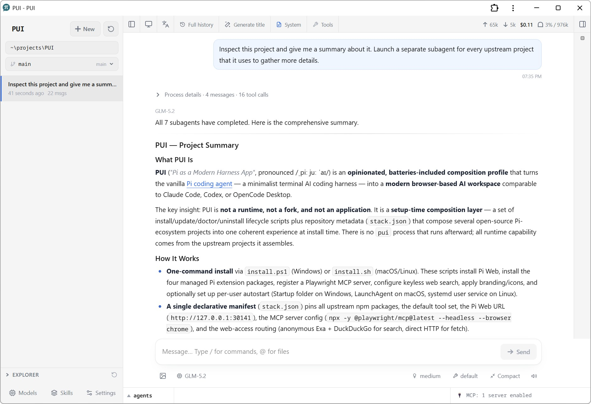

# PUI — Pi as a Modern Harness App

*/ˌpiː juː ˈaɪ/*

PUI turns the [vanilla Pi harness](https://github.com/earendil-works/pi) into a modern browser-based AI workspace, similar to Claude Code, Codex, or OpenCode Desktop. It adds a UI, web search, subagents, `/goal`, and more, all installed in one command.

Pi is a great harness, one of the most efficient on the market. But it's minimalistic by nature, so you don't get a desktop app experience out of the box. PUI solves this by composing open-source projects from the Pi ecosystem at setup time. It adds no PUI runtime process and does not maintain a Pi fork.

[](https://anbeeld.com/support)

## Features

- **Use Pi from a browser.** [Pi Web](https://github.com/agegr/pi-web) provides the local GUI. PUI configures it at `http://127.0.0.1:30141` and can start it automatically for the current user.
- **App-like use via PWA.** To use PUI as an application, open it in a browser and install is as a PWA. This requires user action, so the installer can't do this automatically.
- **Research the web without API keys.** [`pi-web-access`](https://github.com/nicobailon/pi-web-access) routes `web_search` through anonymous Exa and DuckDuckGo, while `fetch_content` uses direct HTTP requests.
- **Split work with subagents.** [`@gotgenes/pi-subagents`](https://github.com/gotgenes/pi-packages) adds in-process subagents for parallel work. Parent-to-child mappings in `~/.config/pui/subagents.json` can select a different default model, with GPT 5.6 Sol using Luna included initially.
- **Drive the session toward a goal.** [`@narumitw/pi-goal`](https://github.com/narumiruna/pi-extensions/tree/main/packages/pi-goal) adds a session-scoped `/goal` mode.
- **Switch between named subscription accounts.** [`@narumitw/pi-accounts`](https://github.com/narumiruna/pi-extensions/tree/main/packages/pi-accounts) adds account switching across supported OAuth providers.
- **Track token usage.** [`@narumitw/pi-usage`](https://github.com/narumiruna/pi-extensions/tree/main/packages/pi-usage) shows current-account usage and limits for the active provider through `/usage`, and toggles Codex Fast mode through `/fast`.
- **Ask before guessing.** [`@juicesharp/rpiv-ask-user-question`](https://github.com/juicesharp/rpiv-mono/tree/main/packages/rpiv-ask-user-question) gives the model a structured questionnaire with typed choices and optional free-form answers.
- **Find files and code fuzzily.** [`pi-fff`](https://github.com/ShpetimA/pi-fff) adds fuzzy file references, path resolution, and indexed content search.
- **Run commands in the background.** [`@99percentpeople/pi-background-tasks`](https://github.com/99percentpeople/pi-extensions/tree/master/extensions/background-tasks) adds pipe and PTY tasks with attachable output. PUI verifies its native `node-pty` dependency during install and update.
- **Automate the browser with Playwright.** PUI configures [`@playwright/mcp`](https://github.com/microsoft/playwright-mcp) through [`pi-mcp-adapter`](https://github.com/nicobailon/pi-mcp-adapter) for lazy, headless Chrome automation.
- **Keep the CLI and browser in the same Pi environment.** PUI aligns standalone Pi with the agent runtime bundled by Pi Web, uses Pi's normal `~/.pi/agent` configuration, and enables Pi's standard local tools by default.
- **Install and maintain the composition as one profile.** Each PUI release pins the direct managed components. The app can discover a stable release once per launch, but it applies one only after you select **Install**. Failed mutations restore and validate the previous certified composition.



## Requirements

- Windows 10 or 11, macOS, or Linux
- Node.js 22.19.0 or newer (`node --version`)
- npm, which is bundled with Node.js
- Git
- `curl` on Linux
- Chrome for the configured Playwright MCP server
- systemd on Linux only when using the default autostart setup

PUI does not install Node.js, Git, or Chrome. When PWA integration is enabled, it creates a per-user autostart entry: a Startup-folder launcher on Windows, a LaunchAgent on macOS, or a systemd user service on Linux. The prerequisite check stops before setup if a required command is missing or Node.js is too old.

The background-tasks package includes `node-pty` prebuilt binaries for supported x64 and arm64 Windows, macOS, and Linux systems. If a compatible prebuild is unavailable, PUI's install/update entry point approves only `node-pty`'s lifecycle scripts and attempts a source rebuild; the required Python and C++ toolchain must then be present.

## Install

Open a terminal in this repository, then run the platform entry point. Or ask your agent to do so.

Windows (PowerShell):

```powershell
./install.ps1
```

macOS or Linux:

```bash
./install.sh
```

Before changing an existing JSON configuration file, the installer creates a timestamped backup. Invalid JSON stops setup safely. For JSON merges, unrelated settings are preserved and PUI manages only the fields and package entries described in [`stack.json`](stack.json).

### Options

| Option | Effect |
|---|---|
| `-NoPwa` / `--no-pwa` | Skip autostart and the browser app-setup page. Pi Web remains installed; start it manually with `pi-web`. |
| `-NoBrowser` / `--no-browser` | Configure autostart but do not open the app-setup page after installation. |
| `-KeylessRoute` / `--keyless-route` | Make PUI's keyless route primary when another primary search provider exists. The other provider remains configured after it. Without this option, the conflict stops installation for an explicit choice. |

## Update, diagnose, and uninstall

PowerShell:

```powershell
./update.ps1
./doctor.ps1
./uninstall.ps1
```

macOS or Linux:

```bash
./update.sh
./doctor.sh
./uninstall.sh
```

- **Update** uses the same transaction worker as the in-app **Install** action. It waits for Pi Web and standalone managed Pi work to become idle, applies exact managed versions from the tagged release, validates the result, and restores the previous certified release after a post-mutation failure. Model-catalog data may still refresh independently.
- **Doctor** reads the installed update-extension identity, exact managed composition, Pi Web bridge, configuration, autostart, and health state without changing the installation.
- **Uninstall** removes the update extension only while its complete PUI-owned shape is intact, removes the owned Pi Web bridge, and restores original Pi Web assets. Add `-Full` / `--full` to also remove managed packages, Pi Web, and standalone Pi. User projects, sessions, authentication, skills, and unrelated settings are preserved. A browser-installed PWA must be removed manually from the browser's app or shortcut settings.

Platform details are in [Windows](docs/windows.md), [macOS](docs/macos.md), and [Linux](docs/linux.md). The [component reference](docs/components.md) describes ownership boundaries and managed files.

## Credits

PUI is a setup and composition layer built on the work of other open-source projects. Its runtime capabilities come from the maintainers and contributors of the projects below. Thank you to everyone who builds, documents, reviews, and maintains them.

| Upstream project | Role in PUI |
|---|---|
| [`@earendil-works/pi-coding-agent`](https://github.com/earendil-works/pi) | Base Pi agent runtime used by the CLI and Pi Web |
| [`@agegr/pi-web`](https://github.com/agegr/pi-web) | Local browser GUI and PWA entry point |
| [`@gotgenes/pi-subagents`](https://github.com/gotgenes/pi-packages) | In-process subagent extension |
| [`pi-web-access`](https://github.com/nicobailon/pi-web-access) | Web search and direct HTTP fetching |
| [`pi-mcp-adapter`](https://github.com/nicobailon/pi-mcp-adapter) | MCP configuration and proxy integration |
| [`@playwright/mcp`](https://github.com/microsoft/playwright-mcp) | Browser automation through headless Chrome |
| [`@narumitw/pi-goal`](https://github.com/narumiruna/pi-extensions/tree/main/packages/pi-goal) | Session-scoped goal mode |
| [`@narumitw/pi-accounts`](https://github.com/narumiruna/pi-extensions/tree/main/packages/pi-accounts) | Named subscription OAuth account switching |
| [`@narumitw/pi-usage`](https://github.com/narumiruna/pi-extensions/tree/main/packages/pi-usage) | Provider usage and limits, and Codex Fast mode |
| [`@juicesharp/rpiv-ask-user-question`](https://github.com/juicesharp/rpiv-mono/tree/main/packages/rpiv-ask-user-question) | Structured questions and typed user choices |
| [`pi-fff`](https://github.com/ShpetimA/pi-fff) | Fuzzy file navigation and indexed content search |
| [`@99percentpeople/pi-background-tasks`](https://github.com/99percentpeople/pi-extensions/tree/master/extensions/background-tasks) | Background pipe/PTY tasks with attachable output; native `node-pty` binding |

Please see each upstream repository for its license, contribution history, and project-specific terms.

## License

PUI is released under the [MIT License](LICENSE). Upstream components retain their own licenses.

## Looking for skills to add into PUI?

- [AGENTS.md: Evidence, Parallelization, Validation](https://github.com/Anbeeld/AGENTS.md)
- [WRITING.md: AI Writing Rules](https://github.com/Anbeeld/WRITING.md)
- [PROMPTING.md: AI Instruction Designer](https://github.com/Anbeeld/PROMPTING.md)
- [RESUME.md: AI Resume/CV Rules](https://github.com/Anbeeld/RESUME.md)

[](https://anbeeld.com/support)
